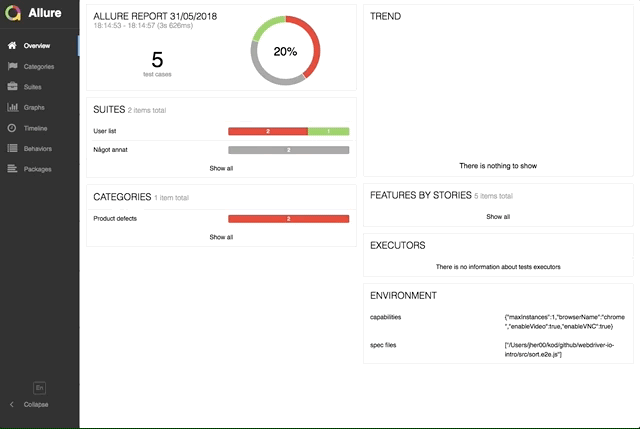

# selenoid-video-api
Node library to manually control a custom Selenoid video recorder

## Intro
This library contains a node api to a interact with a custom Selenoid video recorder,
as well as methods that easily plugs into a few Webdriver.io test hooks for easy setup.

This makes it possible to run many test suites in one go and still make separate recordings of each test case.

There is also easy integration with Allure reports to make them pretty:



## Prerequisites
1. Install Node >= v8: [How to install node](https://nodejs.org/en/download/package-manager/)
2. Install Docker: [How to install docker](https://docs.docker.com/install/)
3. Pull the [manual video recorder docker image](https://hub.docker.com/r/presidenten/selenoid-manual-video-recorder/)
  ```shell
      docker image pull presidenten/selenoid-manual-video-recorder
  ```
4. Install [cm](https://github.com/aerokube/cm) for [Selenoid](https://github.com/aerokube/selenoid):
  ```shell
    curl -s https://aerokube.com/cm/bash | bash
  ```
  - Start selenoid with custom manual video recorder
  ```shell
    cm selenoid start --vnc --tmpfs 128 --args "-video-recorder-image presidenten/selenoid-manual-video-recorder"
  ```
- Make a Webdriver.io project [How to get started with Webdriver.io](http://webdriver.io/guide/getstarted/install.html)

## Test the demo
- To run the demo, make sure prerequisites 1-4 are in place, then:
```shell
  git clone https://github.com/presidenten/selenoid-video-api.git
  cd selenoid-video-api

  # Install project dependencies
  npm install

  # Install demo dependencies
  cd demo
  npm install
```
- Run tests
```shell
  npm run test --silent
```
- Generate allure report (optional):
```shell
  npm run allure
```
  Then navigate to from http://localhost:8080/index.html, click on a failing test and check `Execution Video` in test body

- If not using Allure, the video will be found in `~/.aerokube/selenoid/video`

  Otherwise they are moved to the allure report dir
```shell
 ~/.aerokube/selenoid/video$ ls
User-list-should-be-able-to-sort-ascending-chrome-2018-06-01--16-10.mp4
User-list-should-be-able-to-sort-descending-chrome-2018-06-01--16-10.mp4
```
Selenoid also hosts them for easy viewing: [http://localhost:4444/video](http://localhost:4444/video)

## Installation
- Add this module to your test repo
  ```shell
  npm install selenoid-video-api
  ```

- Check the example config to see how to use this module: [wdio.conf.js](https://github.com/presidenten/selenoid-video-api/blob/master/demo/wdio.conf.js)

  (Ofcourse `const selenoidVideoApi = require('../index.js');` from row 1 in the example needs to be changed to: `const selenoidVideoApi = require('selenium-video-api');`)

  - If you want awesome Allure reports, also check `Custom settings` section on how to configure the Allure reporter and make sure to install it as well
    ```shell
      npm install wdio-allure-reporter
    ```

## Configuration

`selenoidVideoApi.getWdioHooks` accepts the following config, with these defaults:

```javascript
  getWdioHooks({
    usingAllure = false,
    saveAllVideos = false,
    waitForVNCTime = 2000,
    videoMinTime = 500,
  })
```

## Working with the video interface separately

tbd


## Under the hood

Normally when using linking docker containers, a one way connection is specified with
environment variables set in one machine so it can reach the other.

To be able to start/stop the recorder, we need a way to trigger the recorder from the browser.
But it is linked to the recorder for vnc, so the browser has no knowledge of the recorder container.

This is my solution:
- Have a middle man (this library) read `env` from each video recorder and make a map of the recorders name, ip and its corresponding browser ip
- Have each spawned browser figure out its ip inside selenium during runtime
- Have an api to trigger commands in the recorder containers, which accepts browser ip to decide which container to run commands in

### For more details:
- Docker integrations:
[video.js](https://github.com/presidenten/selenoid-video-api/blob/master/lib/video.js)

- Webdriver.io integration:
[wdio.conf.js](https://github.com/presidenten/selenoid-video-api/blob/master/demo/wdio.conf.js)
